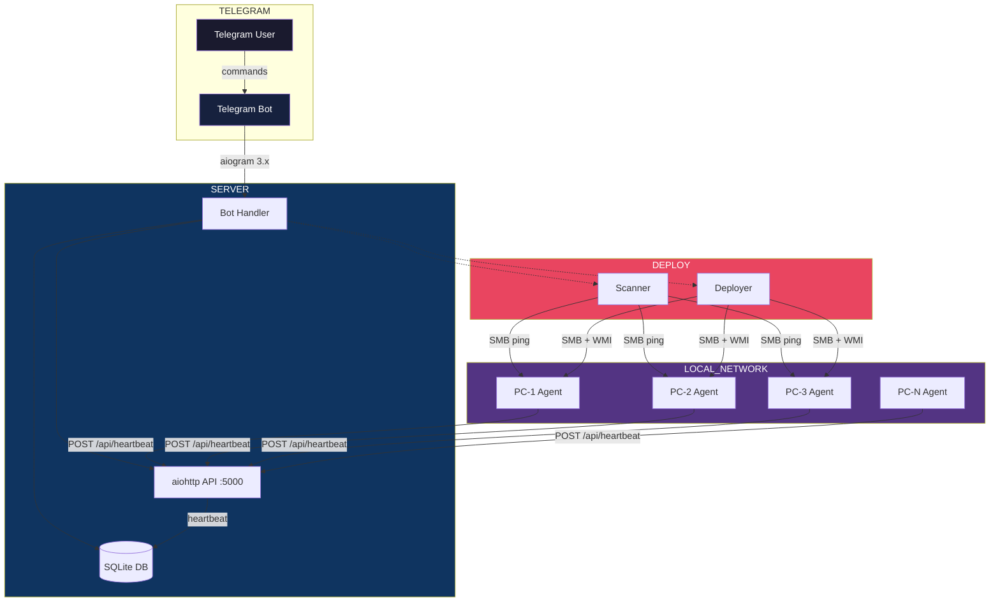
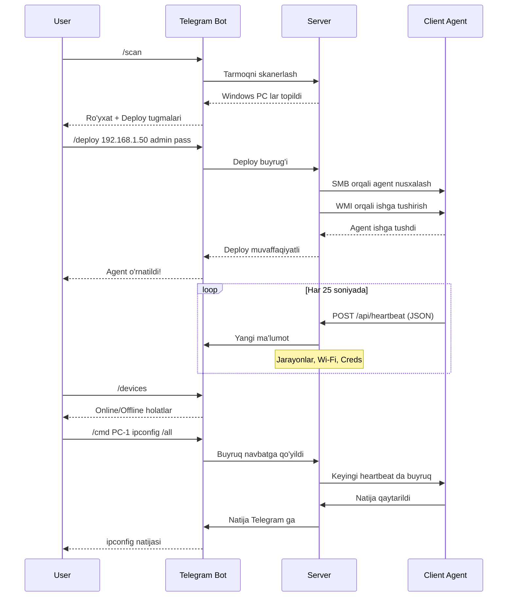
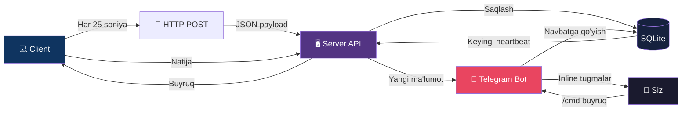

# 🖥️ Personal Device Management System — Telegram Bot

> Uy tarmog'ingizdagi Windows 11 kompyuterlarini Telegram bot orqali boshqaring.
> Tarmoq skaneri + masofadan o'rnatish + monitoring — hammasi bitta joyda.

---

## 📐 Tizim Arxitekturasi



---

## 🔄 Ishlash Jarayoni



---

## 📁 Loyiha Tuzilishi

```
device-monitor/
│
├── 📂 server/                          # Markaziy server
│   ├── 🐍 app.py                       # Telegram bot + HTTP API
│   ├── 🗄️ database.py                 # SQLite database qatlami
│   ├── ⚙️ config.py                   # Token, admin ID sozlamalari
│   ├── 🔍 scanner.py                  # Tarmoq skaneri (ping + SMB)
│   ├── 📦 deployer.py                 # Masofadan o'rnatish (SMB/WMI)
│   └── 📋 requirements.txt            # Server kutubxonalari
│
├── 📂 client/                          # Client agent
│   ├── 🐍 client.py                   # Asosiy agent kodi
│   ├── 🏗️ build.bat                   # PyInstaller build skript
│   └── 📋 requirements.txt            # Client kutubxonalari
│
├── 📂 deploy/                          # O'rnatish
│   └── 🔧 install_client.bat          # Qo'lda o'rnatish skripti
│
└── 📖 README.md                        # Hujjat
```

---

## 🚀 Tezkor Boshlash

### ⚡ VARIANT 1: Bitta Buyruq — Hammasi Avtomatik!

**Linux/VPS da:**
```bash
bash setup.sh
```

**Windows da:**
```cmd
setup.bat
```

Bu skript avtomatik:
1. ✅ Python kutubxonalarini o'rnatadi
2. ✅ Client agent yasaydi (DeviceAgent.exe)
3. ✅ Server IP ni aniqlaydi
4. ✅ Client SERVER_URL ni yangilaydi
5. ✅ Serverni ishga tushiradi
6. ✅ Agar AUTO_DEPLOY yoqilgan bo'lsa — tarmoqni skanerlab, barcha PC larga agent o'rnatadi

---

### 📋 VARIANT 2: Qo'lda o'rnatish

#### 1-Qadam: Serverni Ishga Tushirish

```bash
cd server/
pip install -r requirements.txt
python app.py
```

```
════════════════════════════════════════════
  Personal Device Management Server
════════════════════════════════════════════

HTTP API:     http://0.0.0.0:5000
Admin ID:     5018939044

Client heartbeat URL: http://<SERVER_IP>:5000/api/heartbeat
════════════════════════════════════════════
```

### 2-Qadam: Client Agent Yasash

```
┌─────────────────────────────────────────────┐
│  client/client.py                           │
│  │                                          │
│  │  SERVER_URL = "http://192.168.1.100:5000"│  ← O'zgartiring!
│  │                                          │
│  └──────────────┬───────────────────────────┘
                 │
                 ▼
┌─────────────────────────────────────────────┐
│  build.bat                                  │
│  │                                          │
│  │  pyinstaller --onefile --noconsole       │
│  │                                          │
│  └──────────────┬───────────────────────────┘
                 │
                 ▼
┌─────────────────────────────────────────────┐
│  dist/DeviceAgent.exe  ✅  Tayyor!          │
└─────────────────────────────────────────────┘
```

### 3-Qadam: Agentlarni O'rnatish

```mermaid
graph LR
    A[DeviceAgent.exe] -->|Usul A| B[Qolda]
    A -->|Usul B| C[Tarmoq orqali]

    B --> D[USB/Nusxa]
    D --> E[install_client.bat]
    E --> F[Ornatildi]

    C --> G[/scan Telegram da]
    G --> H[/deploy ip user pass]
    H --> I[SMB + WMI]
    I --> F
```

**Usul A: Qo'lda o'rnatish** (1-3 ta PC bo'lsa)
```
1. DeviceAgent.exe + install_client.bat → har bir PC ga ko'chiring
2. install_client.bat → Administrator sifatida ishga tushiring
3. ✅ Tayyor!
```

**Usul B: Tarmoq orqali avtomatik** (ko'p PC bo'lsa)
```
1. Telegram → /scan
2. Telegram → /deploy 192.168.1.50 Administrator Parol123
3. Yoki → /deployall Administrator Parol123 (barchasiga)
4. ✅ Tayyor!
```

### 4-Qadam: Telegram Bot Ishlatish

```
┌─────────────────────────────────────────────────────────────┐
│  📱 Telegram                                                │
│  ─────────────────────────────────────────────────────────  │
│                                                             │
│  Siz: /start                                                │
│  Bot: 🖥️ Device Management System                           │
│       /devices — Barcha kompyuterlar                        │
│       /scan    — Tarmoqni skanerlash                        │
│       /deploy  — Agent o'rnatish                            │
│       ...                                                   │
│                                                             │
│  Siz: /devices                                              │
│  Bot: 🖥️ Your Computers                                     │
│       🟢 GAMING-PC                                          │
│          ID: a1b2c3d4e5f6                                   │
│          Status: online | Last seen: 2026-04-07T...         │
│       🔴 LAPTOP-OFFICE                                      │
│          ID: f6e5d4c3b2a1                                   │
│          Status: offline | Last seen: 2026-04-07T...        │
│                                                             │
│       [📋 GAMING-PC] [📋 LAPTOP-OFFICE]                     │
│       [🔄 Refresh All]                                      │
└─────────────────────────────────────────────────────────────┘
```

---

## 📋 Buyruqlar Jadvali

| Buyruq | Parametrlar | Tavsif | Misol |
|--------|-------------|--------|-------|
| `/start` | — | Botni boshlash | `/start` |
| `/devices` | — | Barcha PC lar ro'yxati | `/devices` |
| `/device` | `<id>` | Bitta PC ma'lumotlari | `/device a1b2c3d4` |
| `/scan` | — | Tarmoqni skanerlash | `/scan` |
| `/deploy` | `<ip> <user> <pass>` | Bitta PC ga o'rnatish | `/deploy 192.168.1.50 admin pass` |
| `/deployall` | `<user> <pass>` | Barcha PC larga o'rnatish | `/deployall admin pass` |
| `/refresh` | `<id>` | Ma'lumot yangilash | `/refresh a1b2c3d4` |
| `/cmd` | `<id> <buyruq>` | Custom buyruq | `/cmd a1b2c3d4 ipconfig` |
| `/report` | `<id> [json\|csv]` | Hisobot yuklab olish | `/report a1b2c3d4 json` |
| `/history` | `<id>` | Buyruqlar tarixi | `/history a1b2c3d4` |
| `/status` | — | Tizim holati | `/status` |
| `/help` | — | Yordam | `/help` |

---

## 🎛️ Inline Tugmalar

### `/devices` dan keyin:

```
┌──────────────────────────────────────────────┐
│  🖥️ GAMING-PC                                │
│  ID: a1b2c3d4e5f6                            │
│  Status: 🟢 Online                           │
│  Last seen: 2026-04-07 14:30:00              │
│                                              │
│  System Info:                                │
│    • os: Windows                             │
│    • ram_gb: 32.0                            │
│    • processor: Intel i7-12700K              │
│                                              │
│  Processes: 142 running                      │
│  Wi-Fi Networks: 3 saved                     │
│  Browser Credentials: 87 saved               │
│                                              │
│  [🔄 Refresh]     [💻 Command]               │
│  [📄 JSON Report] [📊 CSV Report]            │
│  [📜 History]     [📶 Wi-Fi]                 │
│  [🔐 Browser Creds] [📋 Processes]           │
│  [⬅️ Back]                                   │
└──────────────────────────────────────────────┘
```

### `/scan` dan keyin:

```
┌──────────────────────────────────────────────┐
│  🖥️ Found 4 devices                          │
│                                              │
│  🟢 GAMING-PC                                │
│     IP: 192.168.1.10 | MAC: AA:BB:CC:DD:EE   │
│                                              │
│  🟢 OFFICE-PC                                │
│     IP: 192.168.1.20 | MAC: 11:22:33:44:55   │
│                                              │
│  🟢 LAPTOP-BEDROOM                           │
│     IP: 192.168.1.30 | MAC: 66:77:88:99:AA   │
│                                              │
│  🟢 MEDIA-PC                                 │
│     IP: 192.168.1.40 | MAC: BB:CC:DD:EE:FF   │
│                                              │
│  [📦 Deploy to OFFICE-PC]                    │
│  [📦 Deploy to LAPTOP-BEDROOM]               │
│  [📦 Deploy to MEDIA-PC]                     │
│  [⬅️ Back]                                   │
└──────────────────────────────────────────────┘
```

---

## 🔍 Tarmoq Skaneri — Qanday Ishlaydi

```mermaid
flowchart TD
    A[/scan buyrugi] --> B[Ping Sweep]
    B -->|254 IP tekshiriladi| C{Qaysilar tirik?}
    C -->|Javob bergan| D[SMB Port 445]
    D -->|Port ochiq| E[Windows]
    D -->|Port yopiq| F[Boshqa OS]
    E --> G[Hostname + MAC]
    G --> H[Natija royxati]
    H --> I[Deploy tugmalari]

    style A fill:#e94560,color:#fff
    style B fill:#0f3460,color:#fff
    style E fill:#2ea043,color:#fff
    style F fill:#f85149,color:#fff
    style I fill:#533483,color:#fff
```

| Bosqich | Usul | Natija |
|---------|------|--------|
| 1. Ping sweep | ICMP echo request | Tirik IP lar aniqlanadi |
| 2. SMB tekshirish | TCP port 445 | Windows mashinalar topiladi |
| 3. Hostname | DNS reverse lookup | Kompyuter nomi aniqlanadi |
| 4. MAC address | ARP jadvali | Tarmoq kartasi identifikatori |

---

## 📦 Masofadan O'rnatish — Qanday Ishlaydi

```mermaid
flowchart LR
    A[Deploy buyrugi] --> B[Administrator holatini tekshirish]
    B -->|Disabled| C[Administrator yoqish + parol]
    B -->|Active| D[SMB ulanish]
    C --> D
    D -->|net use| E[C$ share ochish]
    E --> F[DeviceAgent.exe nusxalash]
    F -->|C:\ProgramData\DeviceMonitor\| G[WMI orqali ishga tushirish]
    G -->|wmic process call create| H[Agent ishga tushdi]
    H --> I[Task Scheduler yaratish]
    I -->|schtasks /Create| J[Reboot dan keyin avtomatik]

    style A fill:#e94560,color:#fff
    style C fill:#f0ad4e,color:#fff
    style F fill:#0f3460,color:#fff
    style H fill:#2ea043,color:#fff
    style J fill:#2ea043,color:#fff
```



### Deploy bosqichlari:

```
┌────────────────────────────────────────────────────────────┐
│  0️⃣  Administrator tekshirish: wmic Administrator Disabled │
│      Agar disabled bo'lsa → yoqiladi + yangi parol qo'yiladi│
│  1️⃣  SMB ulanish: net use \\192.168.1.50\C$ /user:admin   │
│  2️⃣  Nusxalash:   copy DeviceAgent.exe \\192.168.1.50\C$\ │
│                     ProgramData\DeviceMonitor\              │
│  3️⃣  Ishga tush:  wmic /node:192.168.1.50 process call    │
│                     create "C:\ProgramData\DeviceMonitor\   │
│                     DeviceAgent.exe"                        │
│  4️⃣  Persistence: schtasks /Create /TN DeviceMonitorAgent  │
│                     /SC ONLOGON /RL HIGHEST                 │
│  5️⃣  ✅ Tayyor! Agent 25 soniyada heartbeat yuboradi       │
└────────────────────────────────────────────────────────────┘
```

---

## 🛠️ Muammolarni Hal Qilish

### Client ulanmayapti

```
❌ Muammo: Client serverga ulanmayapti
│
├── ✅ SERVER_URL to'g'rimi?
│   └── client.py → SERVER_URL = "http://192.168.1.XXX:5000"
│
├── ✅ Firewall 5000-portni ochdimi?
│   └── Windows Defender → Advanced Settings → Inbound Rule
│
└── ✅ Test qiling:
    └── curl -X POST http://<SERVER_IP>:5000/api/heartbeat
        -H "Content-Type: application/json"
        -d '{"device_id":"test","hostname":"test"}'
```

### Bot javob bermayapti

```
❌ Muammo: Telegram bot javob bermayapti
│
├── ✅ BOT_TOKEN to'g'rimi?
│   └── server/config.py → BOT_TOKEN = "7627550368:AAF..."
│
├── ✅ Internet bormi?
│   └── ping api.telegram.org
│
└── ✅ Server ishlayaptimi?
    └── python app.py → xatolar bormi?
```

### Deploy ishlamayapti

```
❌ Muammo: Masofadan o'rnatish xato berdi
│
├── ✅ Username/parol to'g'rimi?
│   └── net use \\<IP>\C$ /user:<username> <password>
│
├── ✅ File sharing yoqilganmi?
│   └── Settings → Network → Advanced sharing → ON
│
├── ✅ SMB 445-port ochiqmi?
│   └── Test-NetConnection <IP> -Port 445
│
└── ✅ Administrator account faolmi?
    └── net user Administrator /active:yes
```

---

## 📊 Ma'lumot Oqimi



---

## ⚡ Xavfsizlik

| Xususiyat | Tavsif |
|-----------|--------|
| 🔒 Admin ID | Faqat sizning Telegram ID botni boshqaradi |
| 🌐 Lokal tarmoq | HTTP faqat ichki tarmoqda |
| 🔑 Bot token | Maxfiy, hech kimga bermang |
| 📦 Deploy | Faqat siz ko'rsatgan IP larga |
| 🚫 Self-replication | Yo'q — hech qayerga tarqalmaydi |
| 🛡️ Firewall | Faqat 5000-port ochiladi |

---

## 📞 Qo'shimcha Ma'lumot

**Texnologiyalar:**
- Python 3.10+
- aiogram 3.x — Telegram bot
- aiohttp — HTTP API server
- SQLite — Ma'lumotlar bazasi
- PyInstaller — .exe yasash

**Tizim talablari:**
- Server: Python 3.10+, internet (Telegram uchun)
- Client: Windows 11, Python 3.10+ (faqat build qilish uchun)
- Tarmoq: Lokal Wi-Fi/Ethernet, SMB yoqilgan
